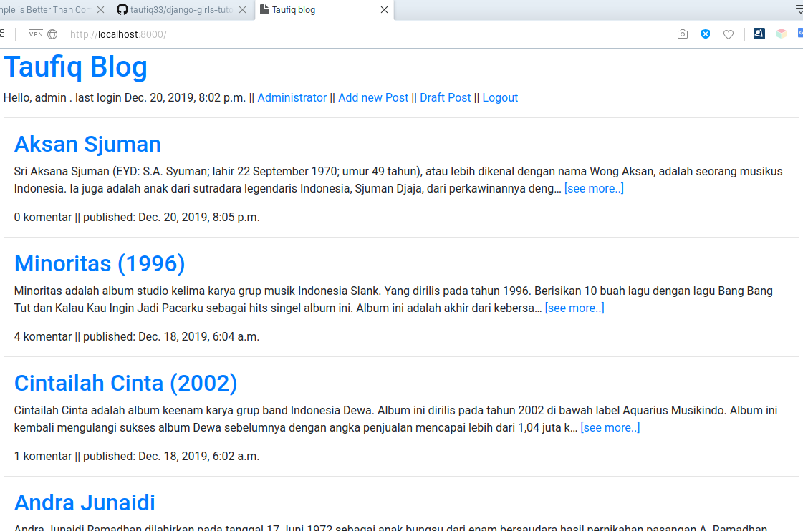

# Django Project based on djangogirls tutorial 



Web link https://taufiqblog.herokuapp.com/

This is my project based on djangogirls tutorial (basic+exstension).
1. Basic https://tutorial.djangogirls.org/en/
2. Exstension https://tutorial-extensions.djangogirls.org/en/

If you want to run this project locally , edit manage.py file, change to :
```python

def main():
    os.environ.setdefault('DJANGO_SETTINGS_MODULE', 'mysite.local_settings')
    try:

```

Then you must have postgresql database name "djangogirls", set your user, password, port etc in mysite/local_settings.py according to your environment.

After that you can create one superuser, with ```python manage.py createsuperuser```.